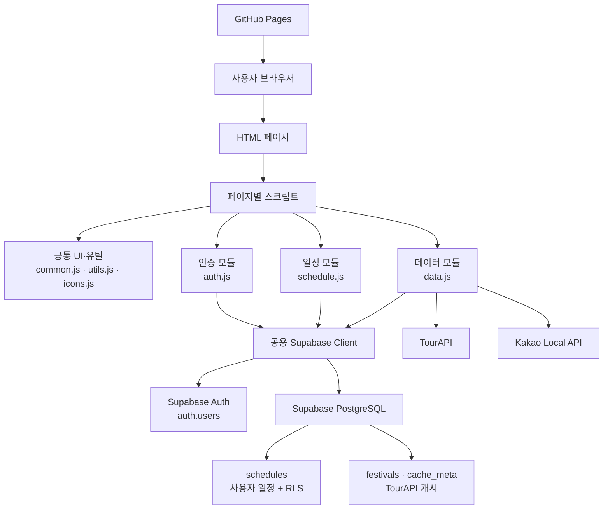

# 🎪 축제 어때

> 전국 축제를 탐색하고 주변 맛집·카페·숙소를 선택해 나만의 일정을 만들고 관리하는 축제 추천 서비스

[🚀 배포 사이트](https://qkdtkd77.github.io/AIBE8_Project1_ACE/)

TourAPI와 Kakao Local API로 축제와 주변 장소를 조회하고, Supabase Auth·PostgreSQL·RLS를 이용해 사용자별 일정을 관리합니다.

## 프로젝트 소개

Figma Make의 프로토타입을 참고해 HTML, CSS, Vanilla JavaScript로 구현한 3인 팀 프로젝트입니다.

```text
축제 탐색
→ 축제 상세 확인
→ 주변 장소 선택
→ 일정 미리보기·저장
→ 내 일정 조회·삭제
```

## 주요 기능

### 축제 탐색

- TourAPI 축제 목록·상세 조회
- 기간·지역·축제 분류 필터링
- 페이지네이션 및 행사 상태 표시

### 주변 장소와 일정 만들기

- Kakao Local API 맛집·카페·숙소 조회
- 거리순 정렬 및 여러 장소 선택
- 일정 미리보기·저장·텍스트 복사

### 사용자 인증

- 이메일·비밀번호 회원가입과 로그인
- 이메일 인증 안내 및 인증 메일 재전송
- 로그인·로그아웃·현재 사용자 조회
- 인증 상태에 따른 공통 헤더 변경

### 사용자별 일정 관리

- 일정 저장·최신순 조회·삭제
- 일정 제목·기간·장소 목록 표시
- 헤더에서 저장된 일정 개수 표시
- 비로그인 사용자의 일정 페이지 접근 제한
- RLS를 이용한 사용자별 데이터 보호

## 기술 스택

| 구분 | 기술 |
| --- | --- |
| Frontend | HTML5, CSS3, Vanilla JavaScript |
| External API | 공공데이터포털 TourAPI, Kakao Local REST API |
| Backend(BaaS) | Supabase Auth, PostgreSQL, RLS |
| Supabase SDK | `@supabase/supabase-js@2.112.1` UMD CDN |
| Deployment | GitHub Pages |
| Test | Browser DevTools, Supabase Dashboard, Postman |
| Collaboration | Git, GitHub Issues, Pull Requests |

## 아키텍처



### 데이터베이스 구조

```text
Supabase PostgreSQL
├─ auth
│  └─ users
└─ public
   ├─ schedules
   ├─ festivals
   └─ cache_meta
```

## 코드 구조

| 파일 | 역할 |
| --- | --- |
| `js/data.js` | TourAPI·Kakao API 요청·변환 및 축제 캐시 |
| `js/supabase/client.js` | 공용 Supabase 클라이언트 생성 |
| `js/auth.js` | 회원가입·로그인·로그아웃·사용자 조회 |
| `js/schedule.js` | 일정 저장·조회·삭제 요청 |
| `js/common.js` | 공통 헤더와 인증 상태 UI |
| `js/utils.js` | DOM 선택·날짜 변환·상태 UI 등 공용 기능 |
| `js/*-page.js` | 페이지별 렌더링과 이벤트 처리 |
| `sql/*.sql` | 일정·축제 캐시 테이블, 권한·RLS 정의 |

페이지 스크립트는 Supabase API를 직접 호출하지 않고 `window.Auth`와 `window.Schedule`을 사용합니다.

```javascript
// 성공
{ ok: true, data }

// 실패
{ ok: false, error }
```

## 인증과 데이터 보호

`schedules` 테이블은 로그인 사용자에게 `SELECT`, `INSERT`, `DELETE` 권한만 제공합니다.

RLS는 `auth.uid()`와 일정의 `user_id`를 비교하여 다음 규칙을 적용합니다.

- 로그인 사용자는 자신의 일정만 저장·조회·삭제 가능
- 비로그인 사용자는 일정 테이블 접근 불가
- 다른 사용자의 일정은 ID를 알아도 접근 불가
- 일정 수정 기능은 제외하여 `UPDATE` 권한과 정책 미구현

## 실행 방법

### 배포 사이트

[https://qkdtkd77.github.io/AIBE8_Project1_ACE/](https://qkdtkd77.github.io/AIBE8_Project1_ACE/)

### 로컬 실행

```bash
git clone https://github.com/qkdtkd77/AIBE8_Project1_ACE.git
cd AIBE8_Project1_ACE
python3 -m http.server 8000
```

브라우저에서 `http://localhost:8000`으로 접속합니다. 별도의 설치나 빌드 과정은 없습니다.

자체 Supabase 프로젝트를 구성하려면 SQL Editor에서 다음 파일을 순서대로 실행합니다.

```text
sql/schedules.sql
→ sql/festivals_cache.sql
→ sql/festivals_cache_add_lcls_systm3.sql
```

> GitHub Pages는 정적 배포이므로 브라우저용 설정값이 공개됩니다. Supabase에는 Publishable Key만 사용하며 Secret·service_role 키는 포함하지 않습니다.

## 테스트

- 회원가입·이메일 인증·로그인·로그아웃
- 인증 메일 재전송과 발송 제한 오류 처리
- 일정 저장·조회·삭제와 화면 갱신
- 비로그인 및 다른 사용자의 일정 접근 차단
- GitHub Pages 환경의 페이지 이동·공통 헤더·콘솔 오류

## 팀원과 담당 역할

| 팀원 | 담당 영역 |
| --- | --- |
| 김태민 | 공통 UI, 축제 목록·필터·페이지네이션, 상세 화면 |
| 김지웅 | TourAPI·Kakao API, 데이터 변환, 주변 장소와 일정 미리보기 |
| 이현정 | Supabase 인증, 이메일 인증, 일정 테이블·RLS, 일정 저장·조회·삭제 |

## 협업 방식

```text
Issue 생성
→ 이슈 기반 브랜치 생성
→ 기능 구현과 테스트
→ dev 브랜치로 Pull Request
→ Squash merge
→ 작업 브랜치 정리
```
